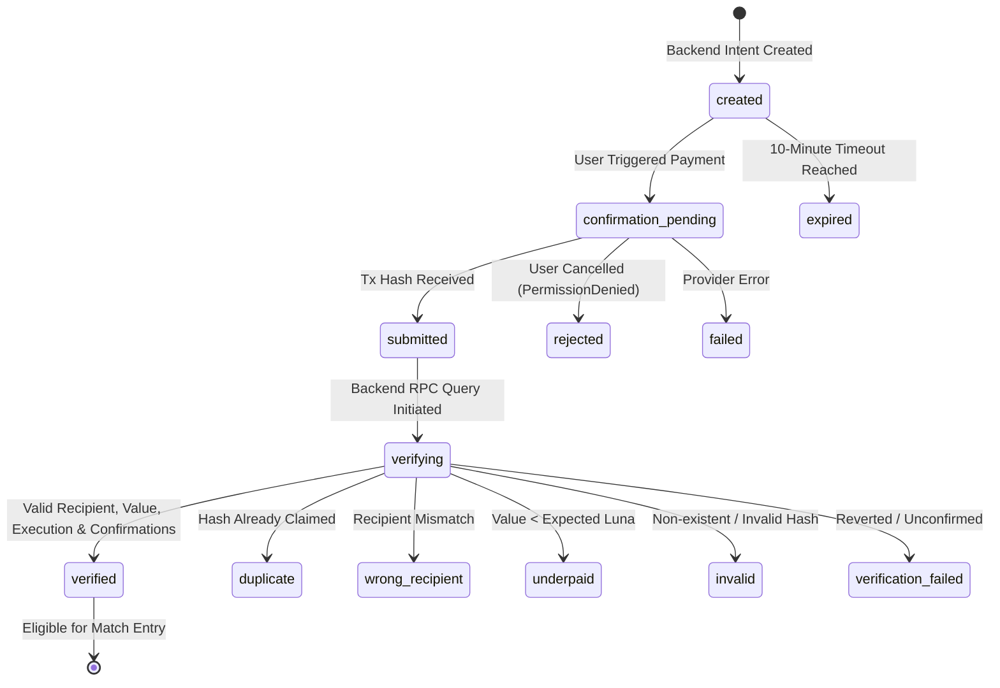

# Nimiq Integration

## 1. Current Status

Nimiq Arena features a complete, zero-trust, server-authoritative payment and transaction verification architecture:
1. **Provider Detection & Account Access**: Uses the official `@nimiq/mini-app-sdk` with `init({ timeout })`. Runs inside Nimiq Pay and requests account approval only upon explicit user action.
2. **Server-Owned Payment Intent Lifecycle**: An intent is created via tRPC with server-configured recipient and Luna amount. The client cannot dictate or tamper with recipient addresses or amounts.
3. **PoS Blockchain Verification Service**: An authoritative backend service (`server/nimiq-verifier.ts`) queries live Nimiq PoS JSON-RPC nodes (`https://rpc.testnet.nimiqwatch.com` / `https://rpc.nimiqwatch.com`) via `getTransactionByHash`.
4. **Authoritative Verification Pipeline**:
   - Validates on-chain transaction hash format and existence.
   - Verifies `executionResult === true` (no reverted transactions).
   - Normalizes and compares `to` address with server-owned `expectedRecipient`.
   - Confirms `value >= expectedValueLuna` (rejects underpaid transactions).
   - Requires `confirmations >= 1` (rejects unconfirmed mempool transactions).
   - Checks `networkId` matches environment.
   - Enforces unique consumption (prevents replay attacks).
5. **Match Entry Gate**: Matches and player seats can only claim verified payment intents. Double claims for the same intent across different matches are authoritatively rejected.
6. **Audit Trail**: Every verification attempt is immutably logged in `payment_verifications`.

## 2. Verified Official API Surface & Status

| Capability | Official Reference | Arena Implementation Status |
| :--- | :--- | :--- |
| Detect Nimiq Pay Provider | `init({ timeout })` | Implemented in frontend (`@nimiq/mini-app-sdk`) |
| Request Nimiq Accounts | `listAccounts()` | Implemented behind user action |
| Request NIM Payment | Provider `sendBasicTransaction({ recipient, value })` | Implemented via server intent & native Nimiq Pay prompt |
| Authoritative Verification | PoS JSON-RPC `getTransactionByHash` | Implemented in `server/nimiq-verifier.ts` & `server/db.ts` |
| Duplicate / Replay Prevention | Database Unique Verified Hash Index & Audit | Implemented & verified across multiple users |
| Match Entry Eligibility Gate | `claimVerifiedPaymentForMatch` | Implemented; restricts paid match entry to verified intents |
| Escrow Payouts | Nimiq Payout Worker | Out of scope for this milestone (per directive) |

## 3. Authoritative Payment State Machine

## 4. References

- [1]: https://www.nimiq.com/developers/mini-apps/overview "Nimiq Developer Center — Mini Apps overview"
- [2]: https://www.nimiq.com/developers/mini-apps/mini-app-tutorial "Nimiq Developer Center — Build Your First Nimiq Mini App"
- [3]: https://nimiq.dev/mini-apps/api-reference/nimiq-provider "Nimiq Provider API Specification"
- [4]: https://rpc.testnet.nimiqwatch.com "Nimiq PoS Testnet JSON-RPC Node"
