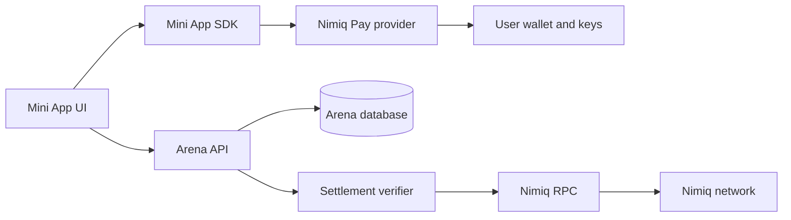
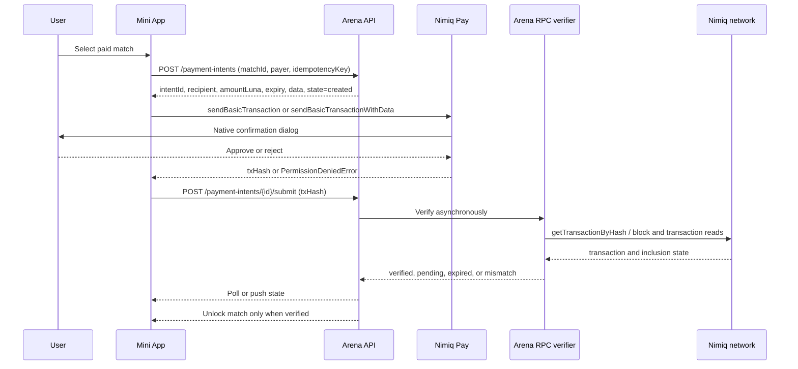

# Nimiq Arena Wallet and Payment Flow Architecture

## Review conclusion

The existing plan is directionally correct: the Mini App should be a thin wallet client, the backend should own authorization and payment state, and a transaction hash returned by Nimiq Pay must not be treated as settlement. The plan should be made more concrete around wallet-session state, signed identity, payment intents, transaction verification, idempotency, and reconciliation.

The current official Mini App API exposes `listAccounts()`, `sign()`, consensus reads, block-height reads, `sendBasicTransaction()`, and `sendBasicTransactionWithData()` through the provider returned by `init()` from `@nimiq/mini-app-sdk`.[^1] Account access, signing, and payment calls require user confirmation; payment calls return a transaction hash, not a verified business outcome.[^1]

## Trust boundaries



The browser and Mini App WebView are untrusted for business decisions. Nimiq Pay is trusted to mediate wallet approval and protect keys. The Arena backend is trusted to authorize users, create payment intents, validate match eligibility, and record business state. The settlement verifier is trusted to interpret the network result, while the Nimiq network is the source of truth for transaction inclusion.

## Wallet connection flow

Wallet connection is better modeled as **account discovery plus application authentication**, not as a generic persistent session.

| Step | Actor | Operation | Authoritative result |
|---|---|---|---|
| 1 | Mini App | Call `init({ timeout: 10_000 })` once and retain the promise | Provider readiness or timeout |
| 2 | Mini App | Call `listAccounts()` only from an explicit user action or clearly explained onboarding step | User-approved list of Nimiq addresses |
| 3 | Mini App | Select the supported account and send its address to Arena API | Untrusted account claim |
| 4 | Arena API | Issue a short-lived challenge containing origin, account, nonce, issued-at, expiry, and domain-separated purpose | One-time authentication challenge |
| 5 | Mini App | Ask the provider to `sign()` the exact challenge bytes/message | User-approved signature and public key |
| 6 | Arena API | Verify signature, challenge expiry, nonce, domain, and account/public-key binding | Authenticated Arena session |
| 7 | Arena API | Create or load the player record keyed by verified account identity | Server-side player session |

The backend should not accept an address as proof of control. `listAccounts()` establishes that the wallet exposed an address, while `sign()` proves control of the signing key for the application challenge. The challenge must never contain a payment instruction and must be single-use.

Recommended client states are `unavailable`, `initializing`, `ready`, `account-requested`, `account-selected`, `authenticating`, `authenticated`, `denied`, and `error`. The UI should distinguish Nimiq Pay being unavailable from a user rejecting a confirmation dialog.

## Payment architecture

Competitive entry payments should use a **payment-intent-first** design. The user never pays to a hard-coded address without an Arena-created intent, and the frontend never decides whether the payment is sufficient.

| Component | Responsibility |
|---|---|
| Arena API | Validate match, price, currency, season, expiry, recipient, and payer account; create a payment intent with a unique idempotency key |
| Mini App | Display the intent details, request the exact transaction through Nimiq Pay, and submit the returned hash |
| Nimiq Pay | Show native confirmation and submit the user-approved transaction |
| Settlement verifier | Fetch and validate the transaction from Nimiq RPC, then monitor inclusion and network state |
| Arena API | Transition the intent to `verified` only after all policy checks pass and unlock the match atomically |
| Reconciliation worker | Retry pending lookups, detect expiry or mismatch, and surface manual-review states without granting entry |

## Payment sequence



The payment intent should bind at least `intentId`, `matchId`, `playerId`, payer address, recipient address, exact amount in Luna, optional data payload, network identifier, creation time, expiry, and an idempotency key. If transaction data is used, the verifier must compare it exactly to the intent or use a documented canonical encoding. Do not infer ownership from a transaction hash alone.

## Payment state machine

```text
created -> awaiting_user -> submitted -> pending -> verified
                    |             |          |
                    v             v          v
                 rejected       failed    mismatch

created/awaiting_user/submitted/pending -> expired
```

`verified` is the only state that can unlock a paid match or produce a rewardable business event. `submitted` means only that the provider returned a hash. `pending` means the verifier has not yet established the required inclusion policy. `mismatch` covers wrong recipient, amount, payer, network, data, or an already-consumed transaction. Rejected and failed states are user-visible but never grant access.

## Idempotency and replay protection

Payment-intent creation must accept a client-generated request key but should also enforce a server-side uniqueness constraint. Submitting the same hash twice must return the existing intent result rather than duplicate credits. A transaction hash must not be accepted for multiple intents unless the business model explicitly permits it, which competitive entry should not.

The server should atomically verify and transition the payment intent, append an immutable ledger event, and unlock the match in one database transaction. Match entry, rating, reward, and settlement records must be linked by stable IDs, not by UI state.

## Failure handling

If Nimiq Pay is unavailable, the app should keep the user in a non-paid state and explain that the Mini App must be opened in the supported host. If the user rejects the native confirmation, the intent becomes `rejected` and can be retried only by creating or reusing a still-valid intent according to policy. If a hash is returned but the transaction is not yet visible, the app shows `pending` and the backend retries; it must not repeatedly prompt the user or create a second intent automatically.

If the transaction is visible but mismatched, the intent becomes `mismatch` and the match remains locked. If the network or RPC verifier is unavailable, the state remains `pending` with an operational alert and reconciliation retry. If the intent expires, the backend must not accept a late transaction without an explicit recovery policy.

## Recommended API surface

| Endpoint | Purpose |
|---|---|
| `POST /v1/auth/challenges` | Create a one-time signing challenge |
| `POST /v1/auth/sessions` | Verify the signed challenge and create a session |
| `POST /v1/payment-intents` | Create or idempotently retrieve a match payment intent |
| `POST /v1/payment-intents/:id/submit` | Attach the provider-returned transaction hash |
| `GET /v1/payment-intents/:id` | Read server-derived payment state |
| `POST /v1/matches/:id/entry` | Unlock entry only after verified settlement |

The frontend should call these endpoints through a typed client. It should never call a public RPC endpoint and decide on its own that a payment succeeded.

## Implementation order

First implement the provider adapter and wallet state machine behind the existing `NimiqWalletPort`. Then implement challenge signing and backend session verification. Next implement payment intents and a fake-free verifier against a Nimiq RPC node in a non-production environment. Only after end-to-end transaction verification is tested should paid match entry be enabled. Ranked results, rewards, and any treasury flow require a separate economic and security review.

## References

[^1]: [Nimiq Developer Center — Nimiq Provider API](https://nimiq.dev/mini-apps/api-reference/nimiq-provider)
[^2]: [Nimiq Developer Center — Mini Apps](https://nimiq.dev/mini-apps/)
[^3]: [Nimiq Developer Center — RPC Methods](https://nimiq.dev/rpc/methods/)
