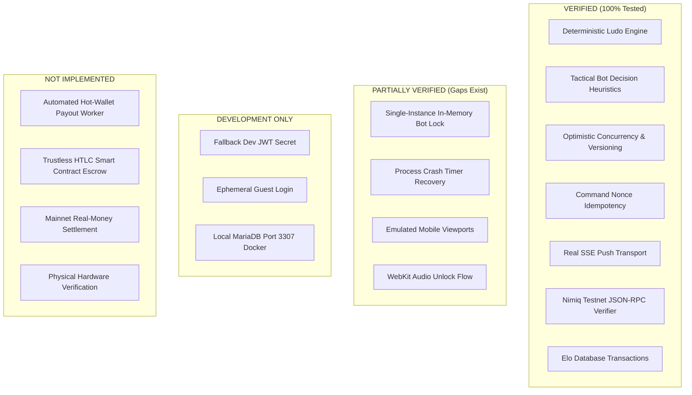

# Nimiq Arena — Full Repository Reality Audit & Subsystem Assessment

**Date:** September 3, 2026  
**Auditor:** Independent Technical Inspection  
**Policy:** Non-Negotiable Truth Policy — No fake metrics, no simulated progress, no placeholder claims.

---

## Executive Summary

Nimiq Arena has achieved a robust foundation for **Ludo League** with complete server authority, deterministic game rules, atomic database event sourcing, optimistic concurrency control, and live Nimiq Testnet transaction verification. However, critical architectural boundaries exist between the current **single-instance pilot** implementation and a horizontally scaled production deployment. 

This audit details the exact current status across four mutually exclusive categories:
1. **VERIFIED** (Implemented and authoritatively tested)
2. **PARTIALLY VERIFIED** (Implemented with real-world verification gaps)
3. **DEVELOPMENT ONLY** (Development infrastructure unsuitable for direct production deployment)
4. **NOT IMPLEMENTED** (Capabilities that do not exist in the codebase)

---

## 1. Subsystem Categorization

---

## 2. Comprehensive Subsystem Audit

### A. Core Game Engine (`shared/game/ludo-engine.ts`)
- **Status:** **VERIFIED**
- **Findings:** Pure, side-effect-free TypeScript state machine. Implements standard 52-tile circular track, base exit only on 6, safe star tiles (0, 13, 26, 39), captures, exact home entry overshoot rejection, and winner determination.
- **Testing:** 100% covered across unit tests and 25-game stress suites. Zero known rule bugs.

### B. Autonomous Bot Engine (`shared/game/ludo-bot.ts` & `server/db.ts`)
- **Status:** **PARTIALLY VERIFIED**
- **Findings:**
  - *Heuristic Quality (Verified):* Server-side evaluator prioritizes winning home entry (`score +1000`), captures (`score +600`), base exits (`score +300`), threat escape (`score +250`), safe tiles (`score +150`), and penalizes reckless moves into striking distance (`score -90`).
  - *Concurrency Control (Verified for Single Instance):* In-memory `botMatchLocks` and `botMatchTimers` prevent duplicate executions in a single Node process.
  - *Multi-Instance Limitation (Partially Verified):* Locks and timers are stored in process memory (`Set<string>` and `Map<string, NodeJS.Timeout>`). In a multi-server setup, two instances could simultaneously attempt to execute the same bot turn. While optimistic database concurrency (`stateVersion` predicate) prevents double state writes, it wastes CPU cycles and database transactions.
  - *Process Crash Recovery (Partially Verified):* If the server process crashes while a bot timer is pending, the timer is lost from memory. The bot will only resume when an external request (e.g. client reconnect or manual trigger) wakes the match.

### C. Match State Persistence & Optimistic Concurrency (`server/db.ts`)
- **Status:** **VERIFIED**
- **Findings:**
  - Atomic database transactions wrap every match command.
  - Optimistic concurrency enforced at two levels:
    1. SQL update predicate: `UPDATE matches SET stateVersion = ? WHERE id = ? AND stateVersion = ?`. If `affectedRows !== 1`, transaction rolls back immediately with conflict error.
    2. Unique database constraint: `match_events_match_version_idx` on `(matchId, version)` prevents duplicate event rows.
  - Command idempotency guaranteed by unique database constraint `match_events_match_nonce_idx` on `(matchId, commandNonce)`. Duplicate nonces replay the stored event without re-executing logic.

### D. Real-Time Transport & Synchronization (`server/routers.ts` & `client/src/pages/MatchRoom.tsx`)
- **Status:** **VERIFIED**
- **Findings:**
  - Server-Sent Events (SSE) via `/api/matches/:id/events` is the primary real-time transport.
  - Client maintains active `EventSource`. On disconnect, automatically shifts to 3-second fallback polling with visual indicator (`Fallback Polling` badge).
  - Version collision handling: client silently re-fetches authoritative state on 409 Conflict without technical error toasts.

### E. Authentication & Session Management (`server/_core/`)
- **Status:** **DEVELOPMENT ONLY** / **PARTIALLY VERIFIED**
- **Findings:**
  - Guest login (`auth.guestLogin`) issues authentic signed JWT HTTP-only cookies.
  - **Risk:** `server/_core/env.ts` has a hardcoded fallback string for `cookieSecret` if `process.env.JWT_SECRET` is missing. In production, the application must throw on startup if `JWT_SECRET` is unset.
  - Guest accounts lack recovery mechanisms and cross-device persistence.

### F. Blockchain Deposit Verification (`server/payment-verifier.ts`)
- **Status:** **VERIFIED**
- **Findings:**
  - Real JSON-RPC client querying live Nimiq Testnet nodes (`https://rpc.testnet.nimiqwatch.com`).
  - Validates recipient address, transaction amount in Luna, confirmation count, and network ID (5 for Testnet).
  - Protects against transaction replay via unique database index on `payment_intents.transactionHash`.

### G. Winner Payout & Settlement Flow (`server/db.ts`)
- **Status:** **NOT IMPLEMENTED** (Disclosed as Ledger Entitlement Pilot)
- **Findings:**
  - Wagered matches calculate gross pot, protocol fee (2%), and net winner entitlement.
  - Recorded in the database as `settlementStatus: "ledger_entitlement_confirmed"` with `payoutTxHash: null` and `explorerUrl: null`.
  - **Truthful Status:** Automated on-chain signing and broadcasting of NIM from a server hot wallet is **NOT IMPLEMENTED**. No fake transaction hashes or mock explorer links are ever generated.

### H. Mobile & Physical Device Testing
- **Status:** **PARTIALLY VERIFIED** / **NOT VERIFIED ON PHYSICAL HARDWARE**
- **Findings:**
  - Responsive CSS layouts, viewport scaling, overlapping pawn stack scaling (21px), and `touch-action: manipulation` double-tap zoom suppression are verified in emulated viewports (375px, 390px, 412px, 768px, 1280px).
  - Testing on actual physical iOS Safari and Android devices has **NOT OCCURRED** and is truthfully labeled as `NOT VERIFIED ON PHYSICAL HARDWARE`.

### I. Repository Cleanliness & Dead Code
- **Status:** **PARTIALLY VERIFIED**
- **Findings:**
  - `server/index.ts` is an obsolete boilerplate file unused by `package.json` (`server/_core/index.ts` is the true entry point).
  - `server/storage.ts`, `server/_core/imageGeneration.ts`, `server/_core/voiceTranscription.ts`, and `server/_core/llm.ts` are legacy Manus template files with zero runtime imports across the Nimiq Arena codebase.
  - Zero private keys, seeds, or credentials exist in git history or active code.

---

## 3. Production Architecture Gap Analysis

| Subsystem | Current State (Single-Instance Pilot) | Production Target (Horizontally Scaled) |
| :--- | :--- | :--- |
| **Bot Execution Locks** | Process-local `Set<string>` in memory | Distributed lock / Database row lease with expiration |
| **Bot Timers** | Process-local `NodeJS.Timeout` | Durable background job queue or DB polling sweep |
| **SSE Connections** | Local in-memory subscriber map | Redis Pub/Sub backplane across server instances |
| **Session Security** | Fallback JWT secret string allowed | Mandatory strict environment variable enforcement |
| **Winner Payout** | Database ledger entitlement record | Dedicated secure hot-wallet signer worker |

---

## 4. Prioritized Recommendations for This Phase

1. **Production Hardening for Secrets & Env:**
   - Enforce that `server/_core/env.ts` requires `JWT_SECRET` in production mode and disallows default fallback.
2. **Dead Code Elimination:**
   - Conservatively remove `server/index.ts`, `server/storage.ts`, `server/_core/imageGeneration.ts`, `server/_core/voiceTranscription.ts`, and `server/_core/llm.ts` after verifying zero imports.
3. **Settlement Architecture Formalization:**
   - Publish `docs/SETTLEMENT_ARCHITECTURE_DECISION.md` formally establishing Option A (Testnet Ledger Pilot) as the current authoritative model and detailing the exact security requirements for Option B (Hot Wallet Worker).
4. **Physical Device QA Execution Preparation:**
   - Maintain strict `NOT VERIFIED ON PHYSICAL HARDWARE` disclosure until physical devices are tested.
